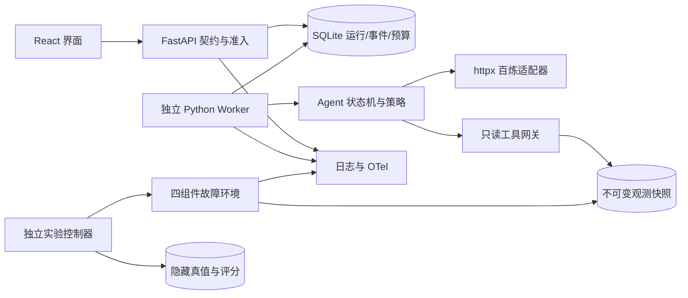

# 架构与关键决策

状态：实施前方案，2026-09-05。约束来自用户；技术版本最终由搭建阶段锁文件记录，当前未安装依赖。

## 技术栈

| 层 | 决定 | 原因与代价 |
| --- | --- | --- |
| 前端 | React + TypeScript + Vite；React Router；TanStack Query；普通 CSS | 适合本地 SPA，路由与服务器状态职责分开；不需要 SSR。锁版本后再确认兼容性 |
| API | Python 3.12、FastAPI、Pydantic 2、Uvicorn、httpx；uv 管理 | 类型边界清晰，异步 I/O；HTTP 客户端直接封装百炼 |
| Agent | 自写 Python 状态机、策略接口、工具注册表 | 不使用 LangChain、LangGraph、AutoGen、Agents SDK 等 Agent 框架；OTel、Pydantic 是基础库 |
| 持久化 | Python sqlite3、WAL、显式 SQL 迁移 | 单机低并发够用；短事务、busy_timeout=5s、单 worker；不在事务中 await |
| 观测 | Python logging JSON + OpenTelemetry tracing，OTLP 到本地 Jaeger | 结构化日志和链路分工；诊断过程另有不可变事件账本，不能只靠 tracing 保存状态 |
| 实验环境 | 轻量 API/任务进程 + Redis + PostgreSQL；Compose 管理实验依赖 | 真实池/队列/缓存观测；业务实验数据库与 Agent 的 SQLite 控制库分开 |
| 验证 | pytest、Ruff、类型检查；前端 Vitest/Testing Library；Apifox CLI、少量 Playwright | 分别覆盖内部逻辑、API 契约和演示闭环，不重复堆叠测试 |

[React 官方](https://react.dev/learn/build-a-react-app-from-scratch) 将 Vite 列为从零构建的工具选项；[FastAPI 文档](https://fastapi.tiangolo.com/tutorial/background-tasks/) 解释了进程内后台任务。本项目需要重启可审计性，因此计划使用独立 worker 而非将长期 Agent 生命周期交给响应后的临时任务。

## 数据流与隔离

API 接受 incident_id，解析服务端预登记快照，拒绝客户端传文件路径、任意 URL、模型名、工具白名单或注入参数。UI、API 和 Agent 只能看到脱敏 incident；实验控制器的真值目录不挂载到 Agent 环境。原始观测不是系统指令，日志中的提示注入文本不能扩大工具权限。

## 模块职责与建议布局

以下是搭建阶段将创建的布局，本阶段没有这些应用目录。

| 路径 | 职责 |
| --- | --- |
| `backend/src/probeops/api/` | DTO、错误处理、路由、关联上下文；不含推理循环 |
| `backend/src/probeops/agent/` | 状态机、六种策略、候选/评分、终止判定 |
| `backend/src/probeops/tools/` | 工具定义、参数/权限校验、快照查询、结果标准化 |
| `backend/src/probeops/llm/` | 百炼协议、预算预留、重试、响应解析 |
| `backend/src/probeops/storage/` | 运行仓储、事件账本、预算流水、迁移 |
| `backend/src/probeops/observability/` | logging、contextvars、tracer、脱敏 |
| `backend/src/probeops/worker/` | 领取、租约、取消、终态提交、崩溃恢复 |
| `frontend/src/` | 页面、类型化 API client、轮询与交互 |
| `lab/`、`evaluation/` | 观测产生/重置；独立真值与离线实验；不进入运行时 API |

内部策略接收不可变 RunState 和工具目录，输出合法 Proposal；工具接收验证后的 ProbeRequest，输出 Evidence；LLM 返回结构化候选建议，必须经 Pydantic 验证。内部类型在搭建阶段实现，外部契约见 [OpenAPI](api/openapi.json)。

## 状态与一致性

`queued → running → completed/failed`；queued 可直接 cancelled；running 可进入 cancel_requested，随后 cancelled。completed 表示流程正常结束，可以是 located 或 unresolved。预算/步数耗尽是 completed + unresolved；依赖不可用、worker 丢失是 failed。cancel_requested 不允许再提交 completed；终态不可逆。

创建时一个短事务检查队列容量、请求体哈希和 Idempotency-Key，插入 run 与 seq=1 事件。相同键相同正文返回同一个 run（仍为 202）；相同键不同正文 409。键保留至少 7 天。body 正规化后计算哈希，策略版本与快照版本固定在 run 内。

worker 用事务原子领取 queued，记录 owner、lease、version；每 5 秒心跳，租约 20 秒。只启动一个 worker；若误启动第二个，数据库条件更新保证一项只被一个 owner 领取。租约到期时由恢复扫描将任务标记 failed/worker_lost，未完成 LLM 预留转 uncertain；首版不自动续跑可能重复计费的模型请求。用户显式重试产生新 run。

每轮用 owner + version 的 compare-and-swap 同时写状态、追加事件、保存证据和费用。取消与终态竞争以事务顺序决定：取消先提交则 worker 只能 cancelled；完成先提交则取消接口返回原终态快照，不伪装已取消。HTTP 取消统一 202 表示已处理请求，客户端检查实际 status。

证据内容不可变，ID 与内容哈希相连，事件序号按 run 单调递增。读事件按 after_seq，重复读取不改变结果；不依赖内存队列，也不以 OTel trace 充当业务记录。[SQLite WAL](https://www.sqlite.org/wal.html) 支持读写并发但仍只有一个写者，故事务必须短，锁冲突返回受控错误并记录，不能借此宣称可水平扩展。

## 决策记录

- ADR-01：先支持固定快照诊断，保留真实故障环境用于生成快照。代价是不能证明在线持续变化场景效果；收益是任务配对公平和回放确定。
- ADR-02：首版游标轮询替代 SSE。代价是约一秒更新延迟；收益是 Apifox 测试、断线恢复、持久化语义更简单。完整 tracing 不依赖 SSE。
- ADR-03：SQLite 控制库 + 独立 worker。拒绝引入 Celery/消息代理作为必要项；单机吞吐与崩溃后不自动续跑是显式限制。
- ADR-04：沿用现有 Apifox Git Spec 模式，以仓库 OpenAPI 文件为契约源，Apifox Specs 维护/同步接口，CLI 维护 API 用例并核对生成资源。代码先遵守契约，不让 FastAPI 自动反向覆盖设计。
- ADR-05：百炼固定快照、关闭思考、直接 HTTP；不把 SDK/框架默认行为混入策略。模型下线或地区不符时先更新记录并重新冻结，不偷偷换模型。
- ADR-06：logging/tracing 覆盖所有路径，但不保存密钥或未脱敏模型正文。审计回放依赖脱敏事件和结构化决策，不要求模型暴露隐式思维链。
