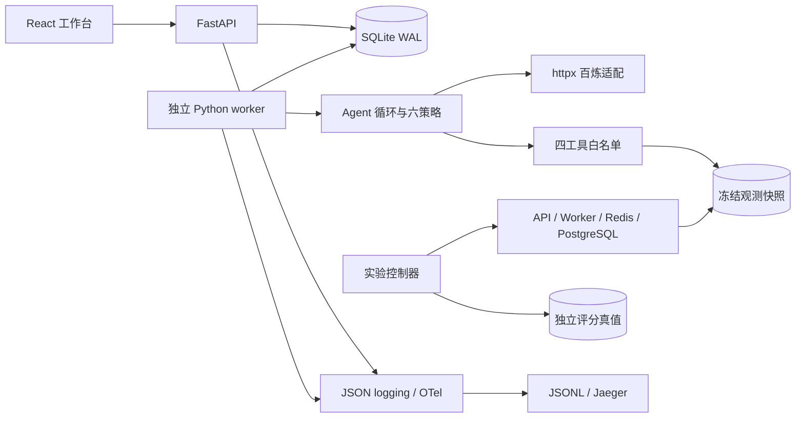

# 架构与实现边界

2026-09-08，版本0.2.0。描述当前代码；历史 P1 见 [原验收](p1-validation.md)。

| 模块 | 实际路径与职责 |
| --- | --- |
| UI | frontend/src：React/TypeScript/Vite、TanStack Query、Router、CSS；任务/策略、假设历史、事件、证据、报告与预算 |
| API | backend/probeops/api.py、models.py；设计源 docs/api/openapi.json 生成前端类型 |
| 存储 | storage.py：SQL、WAL、短事务；运行/事件/证据/冻结上下文/费用流水 |
| 调度 | worker.py：单worker，领取、心跳、取消、超时和崩溃恢复 |
| Agent | engine.py、reasoning.py：候选、交叉预测、六策略、评分/停止；无Agent框架 |
| 工具 | observations.py：10个有限探测、四类只读工具 |
| 模型 | provider.py：httpx、Pydantic、重试与预留/结算；FakeLLM共享循环 |
| 实验 | lab/service.py、capture.py、compose.yaml；注入不进入工具空间 |
| 评测 | evaluation/freeze.py、run.py、summarize.py；真值仅在Agent外评分 |

创建时冻结 snapshot、模型/模式、策略/提示版本、seed、工具/成本/价格并生成config_hash。修改原文件不改变运行。候选更新事件保存历史，证据不可变；业务回放不依赖trace采样。

queued → running → completed/failed/cancelled；取消先cancel_requested（界面显示取消中）。completed不等于located。单worker租约20秒、心跳5秒，失租恢复failed/worker_lost，不自动重跑。队列上限20。SQLite user_version=2增量建表，事务内不await，模型和工具执行在事务外。

取消轮询约100ms，在途HTTP取消保留uncertain。worker总wall deadline限制整个运行。快照观测在to_thread执行，超时后结果不再提交；Python不能强杀线程，因此限定只读、2MB输入与有限工具，不是任意阻塞工具的通用沙箱。

实验服务是宿主机两个Python进程加Compose依赖。真实连接池等待、Redis队列积压有观测，缓存延迟是应用层注入等待，配置错误是阈值拒绝。Agent读冻结数据，不在线访问数据库或控制器。业务请求trace与Agent trace分开。

本地单用户系统无鉴权、无跨主机调度、无生产可用性承诺；监听回环。更换观测源需要新适配与验证，不直接开放shell/网络。依赖锁 uv.lock、frontend/pnpm-lock.yaml；命令见 [README](../README.md)。
