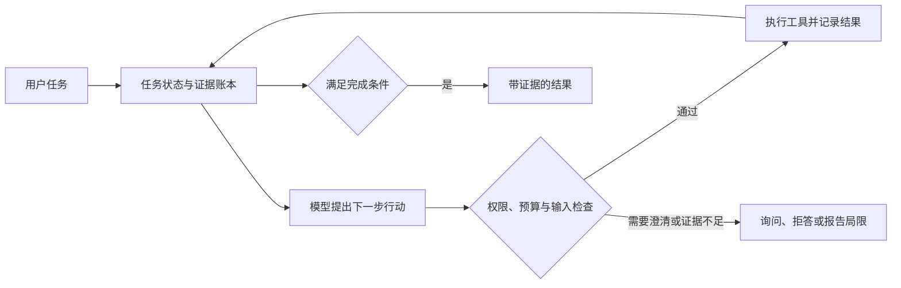

# Agent 项目候选调研：五题对比与技术分析

> 阶段更新（2026-09-05）：用户已选择T1。本文保留选题时的调研/预演记录；实施栈、百炼预算与后续范围以[当前阶段记录](project-plan.md)及其链接文档为准。所有未实测成果仍为待验证假设。

检索日期：2026-09-05。当前为第 2 步交付，题目未选定，系统未实现，实验尚未执行。以下方案与评分是有来源约束的设计判断，不是实测结论。

配套材料：[完整面试预演稿](topic-interview-scripts.md) · [论文、数据、价格及检索记录](topic-evidence.md) · [阶段与批准记录](project-plan.md)。文中的 P 编号对应证据文档中的论文登记。

## 1. 先看结论

优先比较 **T1 ProbeOps：主动探测式故障诊断 Agent** 与 **T2 ClarifySQL：证据与意图分流的数据库查询 Agent**。前者更容易展开系统工程深度，后者更容易控制实现和评测范围。两者评分接近，不能把一分差距理解成客观优劣。

| ID | 候选题目 | 最值得讲的一句话 | 预计总工时 | 含预留 API 预算 | 主要风险 |
| --- | --- | --- | ---: | ---: | --- |
| T1 | ProbeOps：基于竞争假设与探测成本的故障诊断 Agent | 面对同样的超时，Agent 应该先查什么，才能最快排除错误根因？ | 280 小时 | 352.50 元 | 环境与故障样本建设容易超时；外部效度有限 |
| T2 | ClarifySQL：区分可观测事实与用户意图的 SQL Agent | 数据库能告诉我表里有什么，但不能替用户决定“有效订单”是什么意思 | 235 小时 | 285.00 元 | 信息增益提问和执行探针均已有直接近邻 |
| T3 | MemoryLedger：面向计划修订的可追溯记忆 Agent | 一条事实被更正后，哪些旧计划应重新核查，哪些应该保留？ | 250 小时 | 367.50 元 | 容易变成普通记忆库；依赖传播已有工作 |
| T4 | PatchArena：按候选分歧选择测试的代码修复 Agent | 多个补丁都通过可见测试时，下一条测试该测哪里？ | 285 小时 | 390.00 元 | 测试判定器与补丁互相迎合；小任务代表性不足 |
| T5 | EvidenceTrail：预算约束下主动寻找反证的文献核查 Agent | 引用存在不代表支撑结论，Agent 应何时继续找证据、何时承认不足？ | 240 小时 | 337.50 元 | 领域标注和验证器可靠性限制结论 |

这些名称只是当前候选工作名，没有做商标或全网重名检查。预算只针对最终选中的一个项目，工时包含原理学习、编码、实验、阅读失败案例和准备面试。按每周 10 小时约需 24–29 周，按每周 20 小时约需 12–15 周；这是算术换算，不是对你的复习时间安排。

### 评分与理由

各维度 1–5 分：1 为明显不适配，3 为可做但有重要不确定性，5 为在当前约束下较有利。总分为各分项乘权重后除以 5 再乘 100。权重：机制与证据 25%、讲述深度 25%、工程深度 20%、评测可行性 20%、资源适配 10%。这是主观筛选工具，不是研究质量测量。

| 题目 | 机制与证据 | 讲述深度 | 工程深度 | 评测可行性 | 资源适配 | 总分 |
| --- | --- | --- | --- | --- | --- | ---: |
| T1 | 4：竞争假设与成本选择有清晰理论，仍需排查机制近邻 | 5：从网络超时讲到诊断决策与证据 | 5：遥测、状态、注入与隔离完整 | 4：注入标签可验证，但小环境有偏差 | 3：本地环境是最大工时变量 | 87 |
| T2 | 3：近邻非常直接，价值在分流与受控验证 | 5：可展示错误口径与少问错问的权衡 | 4：解析、执行、对话状态有深度 | 5：隐藏意图与确定性答案较易建立 | 5：只读、小库、低成本 | 86 |
| T3 | 3：时间与依赖更新均非首创 | 4：版本、纠错和计划变更容易讲清 | 5：事件、索引、图与一致性结合 | 4：可控事件可评测，真实会话较难 | 4：摄入成本可控但需严格计账 | 79 |
| T4 | 3：测试驱动修复已有大量工作 | 5：算法、测试与模型错误可深入追问 | 5：沙箱、补丁隔离和评测链清晰 | 3：构造任务偏差和判定器问题较重 | 3：环境与重复生成容易消耗预算 | 78 |
| T5 | 3：反证检索和引用核查都有近邻 | 4：证据质量与停止决策值得讲 | 4：检索、证据账本和验证器有内容 | 3：自然语言标签与领域迁移较难 | 4：离线语料可降低 API 成本 | 71 |

若你对 Linux、日志和服务调用不熟悉，T1 的 280 小时估计可能过于乐观，T2 应优先。若你最有兴趣研究长期状态，T3 的兴趣收益可能高于排名差距。推荐不会代替你选题。

## 2. 十二个初始方向与筛选

下表中的淘汰指“本轮不进入五题深研”，不是断言领域缺乏研究价值。初筛依据包括研究证据、可控范围和面试目标；没有把每个淘汰方向做成完整综述。

| 初始方向 | 处理 | 原因 / 收敛结果 |
| --- | --- | --- |
| 1. 云故障根因分析 | 保留 T1 | 有真实工具反馈、明确故障标签，收缩到小型系统诊断 |
| 2. 自然语言数据库查询 | 保留 T2 | 有交互必要性及可执行验证，收缩到只读语义消歧 |
| 3. 长期个人助手记忆 | 保留 T3 | 收缩到事实更正导致的计划修订，避免泛化聊天产品 |
| 4. 自动代码修复 | 保留 T4 | 收缩到函数/小模块补丁选择，排除全仓库万能程序员 |
| 5. 文献研究助手 | 保留 T5 | 收缩到单主张核查与反证搜索，不做自动写综述平台 |
| 6. CSV 数据分析 Agent | 备选 | [InfiAgent-DABench](https://infiagent.github.io/)已有代码执行框架；本轮暂未找到比 T2 更明确的独立机制问题 |
| 7. 旅行规划 Agent | 淘汰本轮 | [TravelPlanner](https://github.com/OSU-NLP-Group/TravelPlanner)已有多约束任务；纯排程可由求解器解决，真实服务调用又引入额外维护成本 |
| 8. 浏览器办事 Agent | 淘汰本轮 | 页面漂移、登录与环境复现会分散精力；[AgentBench](https://github.com/THUDM/AgentBench)可作通用环境参照，但本轮未深入验证浏览器专项基准 |
| 9. 桌面 GUI Agent | 淘汰本轮 | 视觉交互及跨平台环境工程超出本轮首选范围，尚无足够可行性证据 |
| 10. 个性化学习辅导 Agent | 淘汰本轮 | “真正提高学习效果”需要用户实验；短期题目正确率不足以支持教育效果声明 |
| 11. 多 Agent 辩论问答 | 淘汰本轮 | 没有外部判定器容易以模型投票证明自己；多角色数量不构成贡献 |
| 12. 自动科研发现 Agent | 淘汰本轮 | 任务边界、科学真值、实验资源过宽；150–300 小时内难保证形成可信成果 |

## 3. 所有候选共同遵守的设计与评测约束

Agent 的可讲价值来自**依据新观测选择下一步行动**。确定性程序负责权限、状态一致性、预算和执行；模型负责理解非结构化任务、提出假设和选择行动。不会为增加“AI 含量”把确定性检查交给模型，也不以多 Agent 数量作为亮点。ReAct（P02）是已有基础，不是新贡献。

接口仅描述能力，不预定技术栈。所有工具结果携带任务 ID、时间、状态、证据 ID 与成本；超时与空结果分开记录。历史原文保留在日志中，模型上下文使用有来源指针的受限摘要；记录可观察的行动理由和证据，不依赖获取模型隐藏思维链。

各题评测均先划分开发与封存集，再调参数；同一模板、故障谱系、代码母题或同源会话不可跨集合泄漏。正式实验统一模型快照、提示可见信息、工具权限、token 和动作上限；不能用更强模型仅运行新方案。既报告等预算上限的准确率，也报告实际成本及成功率—成本曲线，排除“调用更多所以更好”。

论文式基线如果只能实现简化版本，名称明确加“方法启发基线”，不声称复现论文结果。所有判定器独立于待测 Agent；模型互评仅为辅助信号，不能单独证明正确。以任务为单位报告成对结果和 bootstrap 区间，同题多次运行不能算多个独立样本。小样本只支持探索性结论。

预算统一使用 [官方价格与计算表](topic-evidence.md#4-价格与预算依据)。下文规模是成本规划，不是已收集数据。部署和评测需在选题后的相应获批步骤才执行。

## 4. T1 ProbeOps：主动探测式故障诊断 Agent

### 问题、输入输出与现场演示

为维护小型服务系统的开发者诊断“接口变慢、偶发超时”。输入是告警窗口与系统说明；输出是根因候选排序、可回查证据、仍有争议的解释和下一步建议。演示设置 API、任务服务、缓存和数据库几个组件：同样的超时可能来自队列积压、数据库连接耗尽或缓存访问延迟。Agent 根据反馈改变探查顺序，而不是一次读完所有日志后编故事。

### 理论、已有工作与改进假设

P03 RCAgent 已有自主工具诊断；P04 AIOpsLab 提供故障注入评测思路；P05 GALA 已有图引导探查，P06 已有轨迹评价。**不能宣称首次用图、首次查日志或首次保存推理过程。**

拟检验的窄问题是：在相同动作预算下，根据当前竞争假设的分歧选择低成本探针，是否比图邻域内的贪心探查更少误判“症状为根因”？理论联系 P01 的预期信息量，但实际实现只采用可审计近似。

模型先列出最多 4 个根因假设及各自预期观测，例如“连接池满应表现为等待连接时间长，而非查询执行时间长”。对候选探针计算 `效用 = 预计区分的假设对数 / (归一化探查成本 + ε)`，仅执行工具契约允许的只读探测。模型预期不是似然真值；必须由实际反馈更新假设，并保留“当前候选均不能解释”的出口。消融可检验这一步是否有效，不能据公式声称全局最优或因果识别保证。

### 模块、数据流与 Agent 决策

环境/故障注入器 → 遥测快照 → 假设账本 → 探针选择器 → 工具网关 → 证据更新 → 根因报告。工具能力包括查询指标、按时间窗口读日志、查一次请求的链路、查看允许的配置字段。注入标签只给评测器，不进入日志文件名、任务描述或模型上下文。

确定性网关限制服务范围、窗口大小与返回条数。模型决定查哪种遥测、缩小哪个窗口、保留哪个假设；达到 12 次动作、明确证据条件或无新证据时结束。无证据时返回未定位。最小版不自动重启服务、不改生产配置；“反事实验证”只在评测器控制的实验副本中恢复故障因素，不能把相关性日志写成因果证明。

### 数据、基线与消融

构建 80 个可重放故障场景：20 开发、60 封存，涵盖连接池、队列、缓存、配置错误及无故障/未知类型；按故障家族与参数组合分组。采用应用层故障注入，避免依赖本机内核网络注入权限。真实服务遥测为主，录制回放用于对照；仅回放时明确称离线诊断。

六种设置：固定排障流程、普通 ReAct、依赖图贪心、完整方案、去掉成本项、用随机探针替代分歧选择。60 × 6 × 3 = 1,080 次正式轨迹。每条输入累计约 25k、输出约 4k tokens，约 27M / 4.32M；连同额外对照仍封顶 36M / 6M。若真实单条成本超出，先减少开发期范围而非偷偷缩减困难测试样本。

主指标为根因位置与类型同时正确率；辅助指标为工具次数、证据引用有效率、未知故障误断言率、总费用与延迟。无故障场景考查不误报；遥测缺失、同症状不同根因、工具超时、跨时间窗口污染是必要边界用例。不能仅用报告文本与参考答案的词面相似度判分。

### 范围、工时与面试价值

280 小时：理论与排障知识 40、环境与注入 80、Agent 核心 45、实验和失败分析 70、演示与讲稿理解 45。最小版为一个小系统、单故障、只读诊断；多故障、真实 Kubernetes 和自动修复均为可选扩展，不纳入工时承诺。AIOpsLab 在当前 macOS 上完整运行未验证，避免把其部署当作先决条件。

可讲：网络超时和重试、进程资源、队列与锁、依赖图遍历、观测与因果的区别、API 状态机和公平实验。必须承认：如果候选假设本身漏掉真因，再好的探针选择也可能无效；如果手写规则已经覆盖所有故障，Agent 未必更划算。即使无提升，仍可交付可重放环境、诊断轨迹和能力边界报告。

## 5. T2 ClarifySQL：证据与意图分流的数据库查询 Agent

### 问题、输入输出与现场演示

用户问“上月有效订单的平均金额”，数据库同时有创建时间、付款时间、状态和退款字段。“有效”及“上月按哪种时间计算”不完全由表内容决定。输入为自然语言问题、只读数据库与公开口径说明；输出是必要澄清、最终 SQL、计算结果及每个口径的来源。

演示中，Agent 可以查明状态字段有哪些取值，却必须问用户是否排除退款订单。用户选择后，系统更新解释、执行查询并展示为何之前的两个 SQL 会得到不同结果。

### 理论、已有工作与改进假设

P07 AmbiQT 支持多解释设定；P08 AmbiSQL 已会提问；P09 已按信息增益选择问题；P10 SOMA-SQL 已利用执行探针；P11 BIRD-INTERACT 已提供动态交互。**这些机制都不是本题首创。**

拟研究的改进是“歧义来源分流”：把候选分歧拆成数据库可观测事实、已提供文档口径、必须由用户给出的意图三类。调度器优先用廉价、确实能回答该类问题的工具；对主观口径禁止仅因某个 SQL 有结果就宣布消歧。是否能减少无效探测与错误自信，需要与 EIG 提问及执行探针基线比较。

候选最多 4 个，按聚合口径、过滤条件、连接路径等语义维度分组；不对仅别名不同的 SQL 重复计票。可用 `预计候选分组缩减 / 动作成本` 近似排序，但不将模型自报概率当作可靠分布。执行结果相同不能证明查询语义等价；不同只能证明存在差异，不能决定哪个符合用户意图。

### 模块、数据流与 Agent 决策

问题解析 → 候选口径账本 → 歧义来源判断 → 选择查看 schema / 读口径文档 / 小样本聚合 / 询问用户 → 更新候选 → 执行与解释。每个口径附“来自文档、用户回答或仍为假设”的标记。

只读连接、SQL 解析检查、语句白名单、执行超时和行数上限由程序执行，不能只检查字符串是否含 SELECT。模型根据反馈选择工具，最多 8 个工具动作、2 轮澄清。用户不回答或意图互相冲突时输出待确认口径与候选，不猜出唯一答案。所有查询在同一快照上比较，防止数据变化造成假分歧。

### 数据、基线与消融

自建 120 个有明确意图契约的小型任务，30 开发、90 封存，涵盖时间、去重、NULL、退款、连接路径和无歧义问题。至少 4 个不同业务 schema，模板按组隔离；由确定性用户模拟器只回答被问到的口径，不能泄漏参考 SQL。参考结果由预写 SQL 与手工检查交叉确认。另考查 BIRD-INTERACT 的只读任务资源，但其复杂环境不作为最小交付必需。

六种设置：一次生成执行、普通 ReAct、EIG 提问方法启发基线、执行探针方法启发基线、完整分流方案、取消意图边界的消融。90 × 6 × 2 = 1,080 次正式交互，每条累计 18k / 3k tokens 约 19.44M / 3.24M，封顶 24M / 4M。两种近邻基线必须获得相同候选集和允许的信息，不能通过禁用它们的澄清能力制造差距。

主指标是匹配隐藏意图的答案正确率；辅助指标为澄清次数、错误自信率、无意义探针比例与费用。使用多组数据库实例区分偶然执行等价，但评测器的隐藏实例不回流给 Agent。边界用例：两 SQL 同结果、空表、全 NULL、用户拒答、文档与用户冲突、查询超时、无歧义却被反复追问。

### 范围、工时与面试价值

235 小时：理论与近邻 35、数据及用户模拟器 50、只读工具与状态机 55、实验 55、演示和口述准备 40。最小版支持有限的 SELECT、JOIN、聚合和日期条件；不做数据库写操作、通用 BI 平台或全方言适配。预算 285 元，余量较大。

可讲：关系代数、连接与聚合语义、NULL 三值逻辑、查询计划与快照、信息增益、交互成本及知识边界。数据库属于相关专业基础，不把所有内容都称为 408 统考考点。若分类经常错或规则已足够，则分流机制未必值得；仍能交付有意图契约的评测集及可靠交互系统。该题是受约束的机制组合改进，不能包装成新的 Text-to-SQL 范式。

## 6. T3 MemoryLedger：面向计划修订的可追溯记忆 Agent

### 问题、输入输出与现场演示

面向持续协作的项目助手。早先记录“周五演示，周四冻结代码”，后来用户说“演示改到周三，原周五安排作废”，助手可能只更新日期，却继续推荐周四冻结。输入为带来源和时间的会话、项目规则、当前任务；输出为修订后的行动建议、受影响的旧结论，以及没有被改变的事实。

演示用虚构项目事件，展示一次更正如何改变依赖它的计划，再询问“上周我们原本如何安排”，检查系统是否既能使用当前信息又能保留历史。Agent 需要在检索原始事件、询问缺失条件和局部重算之间选择。

### 理论、已有工作与改进假设

P12 LongMemEval 支撑更新、时间推理与拒答评估；P13 Zep/Graphiti 已有时态失效；P14 MemState 已讨论跨依赖修订。**时间戳、来源指针、依赖传播都不构成本题独有创新。**

改进假设是：在有限上下文和调用预算下，先找出“当前任务将使用且受更正影响”的派生记忆，再验证或重算，能否比每次全量重建节省成本，又比仅更新单条事实减少陈旧计划？重点是按当前任务选择重算范围、显式区分否定旧事实与事实自然变化，而非打造新记忆数据库理论。

事实节点区分事件发生时间、记录时间、适用范围和原文来源。派生结论记录前提 ID 与版本；前提变化后先标为待验证，不直接把它判成事实上的错误，也不立即删除。程序按反向依赖定位影响集合，复杂度在显式图中为 O(V+E)；模型负责原文语义与当前任务相关性判断，该判断仍可能遗漏或过度扩散。

### 模块、数据流与 Agent 决策

事件日志 → 原子事实提取 → 更正/变化判定 → 版本化事实与依赖索引 → 当前任务检索 → 选择回读原文/澄清/重算 → 带证据计划。计划只写入本地虚构任务板，不接真实日历或联系人。

事务性写入避免“事实更新了但派生索引未更新”。重复事件按来源 ID 去重；相互循环的依赖合并为待验证集合并设轮数上限。用户自己的更正与文档摘录不能自动按“最近一句赢”处理，先检查适用范围和明确撤回关系。最多 10 次工具动作；证据不够时保留冲突、请求澄清或不作具体安排。

### 数据、基线与消融

构造 80 条虚构项目事件序列，20 开发、60 封存，每条覆盖事实变化、纠错、历史查询、互不相干事件和派生计划；模板及项目身份分组隔离。预定义事件和日程约束产生隐藏真值，文本只是这些事件的表述。不能让同一个模型先编故事、再凭自己的故事随意打分。

六种设置：全历史输入、普通检索记忆、时间感知单条更新、每次全量重建、完整局部重算、去掉当前任务相关性过滤。60 × 6 × 3 = 1,080 次轨迹。另用 20 条 LongMemEval cleaned 外部检查 × 4 种适用设置 × 1 次，单独报告；不改写长历史后还沿用原成绩名称。最小版用 API 和简单关键词检索，避免引入本地模型；向量检索可作为后续公平对照，但要记入调用预算。

正式输入上限 40M / 输出 6M 包含记忆摄入、所有方案和外部样本。记忆入库成本不能隐藏为“一次性免费”，共享索引只允许在配置与数据完全相同的重复查询间复用。主指标为当前约束一致的计划成功率；同时测历史问答准确率、陈旧前提使用率、无关记忆误改率、重算节点数、摄入/查询成本。边界包括晚到事件、同名实体、撤回后恢复、跨项目同日期、循环依赖与两个来源冲突。

### 范围、工时与面试价值

250 小时：理论与数据 40、事件/事实/依赖模块 65、Agent 与工具 45、实验 60、演示和面试准备 40。最小版限项目安排与明确条件推导；不承诺通用人生记忆或完整自然语言逻辑证明。2026 年 LongMemEval-V2 已存在，但大规模多模态轨迹不纳入预算最小版。

可讲：缓存失效、事件溯源、双时态、图遍历、事务、增量计算以及检索相关性与事实有效性的区别。若依赖完全由人预写且任务始终是固定日程计算，普通程序即可解决，Agent 价值只剩自然语言入口；需保留含歧义原文和选择性查证的任务。若局部重算漏检严重，则承认全量重建更稳，不能仅凭节省 tokens 宣称方案更好。

## 7. T4 PatchArena：按候选分歧选择测试的代码修复 Agent

### 问题、输入输出与现场演示

面向小模块缺陷修复。输入为函数规范、有缺陷代码和少量可见测试；输出为候选补丁、选择证据、运行过的测试与未验证边界。示例是闭区间合并：两个补丁都通过普通重叠用例，但只改排序与修改端点比较的方案在边界相接、重复区间上会不同。Agent 应把有限测试机会放在能区分候选的输入上。

### 理论、已有工作与改进假设

P15 SWE-agent 已有读代码、编辑和测试闭环；P16 EvalPlus 证明可见测试不足以充分检验代码；P17 已研究测试与补丁协同生成及测试感知选择。**自动生成测试、运行测试和修复后复查都不是新点。**

拟验证：固定补丁候选池后，按输出分歧主动挑选下一批测试输入，是否比随机输入和规范边界枚举更有效地识别错误补丁？理论联系 P01 的实验辨别思路。候选之间不一致只能告诉我们“值得查”，不能告诉我们哪个正确。

预计信息量由候选在输入上的输出分组数近似，结合执行成本选测试；结果由独立的规范判定器或经人工确认的性质判定。模型不同时拥有修改规范、修改隐藏测试与提交补丁的权限。只在清晰规范的受控函数上使用判定器，例如区间并集等价和排序后无交叠，而不是让模型自己编造期望答案。

### 模块、数据流与 Agent 决策

规范及代码读取 → 初始候选补丁 → 分歧输入建议 → 隔离执行 → 独立判定反馈 → 选择或修改候选 → 补丁报告。Agent 可查看源码、提交针对指定文件的补丁、运行公开测试和请求公开性质检查；最多 12 个动作、每题 3 个候选，防止无限采样。

每个候选使用独立目录和干净环境；工具网关限制可写路径，隐藏判定器不在 Agent 工作区。运行环境禁用网络并设 CPU、内存、输出和时间限制。超时不是语义错误的自动证据，先区分环境失败与算法复杂度问题。补丁不能跳过断言或吞掉异常来“通过测试”。

### 数据、基线与消融

从 EvalPlus 的公开规范参照及自写小模块构建 60 个可解释缺陷，15 开发、45 封存，按母题和缺陷变换分组。这是**派生修复任务**，不是原版 HumanEval+ 分数。生成前人工确认规范和参考实现；使用独立隐藏测试做最终评价，不向 Agent 返回隐藏测试的具体输入与答案。公开可调用的性质判定器与隐藏最终测试分离。

六种设置：一次修复、普通 ReAct 修复、固定规范边界测试、随机测试、完整分歧选择、只按模型置信度选补丁。45 × 6 × 3 = 810 次轨迹。比较选择器时共享相同候选池、测试预算和可见信息；另外小样本端到端比较，防止候选池实验掩盖生成成本。论文复现不可行时明确标注是方法启发基线。

主指标为隐藏测试通过的完整修复率；辅助指标为错误补丁接受率、回归引入率、缺陷检出效率、执行与模型成本。除错误输入外必须测合法极端输入、重复元素、空输入、非确定性和资源耗尽。形式性质只覆盖特定规范，不能推出任意代码正确。正式预算上限 40M 输入 / 8M 输出，包含候选生成与端到端检查，含预留约 390 元。

### 范围、工时与面试价值

285 小时：理论与任务整理 45、隔离环境与判定器 70、Agent 和选择器 55、实验 70、演示与面试 45。最小版单语言、函数或小模块；现有 EvalPlus 生态主要为 Python，可按其原始环境适配，不因算法题常用 C++ 而改写整套基准。语言最终仍由选题后确认。不纳入真实仓库海量依赖修复、跨语言迁移或自动提交外部 PR。

可讲：边界条件、程序语义、复杂度、变异测试、差分测试、进程隔离和实验偏差。主要局限是受控缺陷不代表真实软件缺陷；若候选全都犯同一种错，分歧选择会失效，需要保留规范边界探测。即使没有提升，也可交付错误补丁谱系与评测器审计，而不虚报“自动修复所有 Bug”。

## 8. T5 EvidenceTrail：主动寻找反证的文献核查 Agent

### 问题、输入输出与现场演示

面向阅读文献的学生，核查一条明确主张，而不是生成整篇综述。输入为主张和固定的开放文献语料；输出为“支持、反驳、证据不足”及逐句引用、条件限定和搜索过程。示例是某方法是否在给定任务与数据条件下优于对照，Agent 首先找到支持段落，随后主动搜索可能限制该结论的条件。

正式量化评测使用 SciFact 主张，现场可展示一条其中的公开样例。若另加 CS 文献演示，必须人工准备可核查的小语料和标签，单独标记，不把科学文献基准成绩直接外推到 CS 研究能力。

### 理论、已有工作与改进假设

P18 SciFact 提供主张和证据标签；P19 ALCE 区分答案与引用质量；P20 PaperQA2 已有检索、汇总和矛盾发现；P21 更进一步检查验证器本身的可靠性。**带引用、会查反例和使用验证器都不够新。**

窄改进是预算内的“证据覆盖缺口驱动搜索”：先把主张拆成对象、关系和适用条件；仅在某个关键条件未被覆盖或支持/反驳相冲突时继续检索，优先查询尚未检查的反证方向，而不是固定每题查相同次数。价值在于较少无效查询下减少无依据断言，仍需实测。

模型只生成检索动作和证据关系建议；引用 ID、段落范围和原文一致性由程序校验。语义蕴含无法仅靠字符串判定，需要用人工金标校验模型验证器，并报告它的误判。固定开发集上的停止规则，不把模型自报“很确定”当作概率，不借用 P21 的共形保证。

### 模块、数据流与 Agent 决策

主张分解 → BM25 检索工具 → 证据段落读取 → 支持/反驳/未覆盖账本 → 选择补查方向 → 核查器 → 带条件结论。检索初版使用固定语料和 CPU 索引，不依赖付费搜索或本地模型。语料文本作为待分析数据，不能把文章中的指令当成系统命令。

最多 6 次检索/补读决策；覆盖不足、证据冲突无法消解或额度用尽则输出证据不足。文献不同研究条件下得出不同结果，不自动判定为相互矛盾。同一论文的重复段落不能算独立来源，多篇引用同一原始研究时标记依赖而不重复加权。

### 数据、基线与消融

从 SciFact train 选择 30 条用于开发规则，从 dev 按支持/反驳/证据不足分层封存 150 条用于本地评测；明确这属于官方 dev 的子集，不声称官方隐藏 test 成绩。语料保留检索干扰文档，不能只给金标证据。标签只给评测器。若样本同一主张派生自相同论文，成对区间计算以相关组为单位。

六种设置：固定 top-k RAG、普通 ReAct 检索、固定两轮正反检索、完整缺口搜索、去掉反证方向、去掉证据覆盖停止规则。150 × 6 × 2 = 1,800 条轨迹；每条约 12k / 2k tokens，加预处理与核查约在 32M / 6M 预算内。所有设置都拥有相同语料、检索器和验证器，避免把更换检索器的收益错记为规划收益。

主指标为三分类宏平均 F1，另报带正确依据的任务成功率、证据句 F1、无支持主张率、拒答覆盖率和费用。对 30 条按预测类别与冲突类型分层的输出作盲式人工审阅，报告与自动验证器的一致性；只有一名审阅者时承认单人标签限制，不伪称专家评审。边界包括否定词、样本范围变化、缺失全文、摘要不含细节、伪引用、空检索及互相转引。

### 范围、工时与面试价值

240 小时：理论和数据理解 40、语料索引与证据工具 45、Agent 与核查模块 50、实验和人工审阅 65、演示与口述准备 40。最小版限英文摘要与单主张核查；不纳入全文 PDF/OCR、多模态表格、实时全网研究或学术写作自动化。

可讲：信息检索、倒排索引、精确率与召回率、检索失败和推理失败分离、证据依赖及停止策略。若静态 RAG 已足够准确，Agent 可能只增加成本；若金标没有覆盖新检索到的合理证据，要人工分析而非机械认定模型错误。负面结果可以解释在哪些任务上固定流程更合适。

## 9. 如何用这份报告做选择

先分别读 T1 与 T2 的三分钟稿，再看自己是否愿意深入理解它们的五组追问。对事件状态和记忆一致性明显更感兴趣，则读 T3；喜欢程序语义和缺陷分析则读 T4；喜欢文献证据和评估方法则读 T5。

选择标准不应是题目名称听起来最先进，而应是你愿意亲自复现、解释失败并回答实现细节。正式简历中的每个数字都需要对应实验记录，每句“我负责”都需要对应真实贡献。当前五题的机制收益、运行性能和本机部署均 **Unverified：本阶段只做了来源核查与方案设计，验证方法已逐题列出，尚未获得或执行后续实现授权**。

第 2 步到此结束，等待用户验收批准后进入第 3 步选题确认。本文中的最小范围用于评估可行性，不是已经批准的实施计划。
